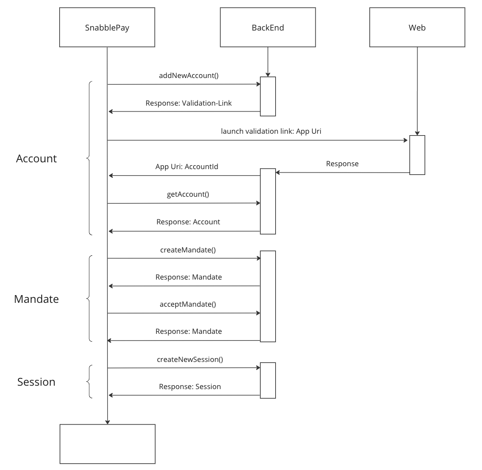

[](https://github.com/snabble/snabble-pay-android-sdk/actions/workflows/test.yml)
[](https://github.com/snabble/snabble-pay-android-sdk/actions/workflows/detekt.yml)
[](https://github.com/snabble/snabble-pay-android-sdk/actions/workflows/codestyle.yml)

# Snabble Pay Android SDK

## Requirements

```
minSdkVersion = 21
compileSdkVersion = 33
java 8

```

## Installation

#### Using the snabble github Repository

Add the snabble Repository to your gradle Repositories

```groovy
repositories {
    maven {
        url 'https://raw.githubusercontent.com/snabble/maven-repository/releases'
    }
}
```

Then add the library to your dependencies.

```groovy
dependencies {
    // core library
    implementation 'io.snabble.pay:sdk:{currentVersion}'
}
```

## Getting started

### Initialize Snabble Pay

To use and integrate Snabble Pay into an existing application an instance of `SnabblePay` is needed.
To initialize `SnabblePay` a configuration needs to be provided over the SnabblePay builder function.

```kotlin
val pay: SnabblePay = SnabblePay.getInstance(context = context) {
    baseUrl = "https://payment.snabble-staging.io"

    snabblePayKey = "shOnRkO4y5Gy..."
    onNewAppCredentialsCallback =
        SnabblePayAppCredentialsCallback { id: String, secret: String ->
            sharedPreferences.saveAppCredentials(id, secret)
        }

    val (id, secret) = sharedPreferences.getAppCredentials() ?: return@snabblePay

    appIdentifier = id
    appSecret = secret
}
```
The app credentials generated by the API can be persisted over the `SnabblePayAppCredentialsCallback`. Keep in mind
that these credentials need to be stored an provided in the configuration to hold an existing user. Otherwise the API generates new
app credentials with each call.

### Example Flow for a new account, new mandate and a session start

The following sequence displays the basic flow (happy path) from creating a new account up to starting a new session.


Use `addNewAccount` to receive an `AccountCheck` holding the validation link.
```kotlin
snabblePay.addNewAccount(
    appUri = appUri,
    city = city,
    twoLetterIsoCountryCode = twoLetterIsoCountryCode
)
```
The given `appUri` will be called by the backend after the account verification to navigate back to the application.
The given `twoLetterIsoCountryCode` need to be provided in two-letter-format (also see: [supported values](https://docs.payone.com/pages/releaseview.action?pageId=1213959) )


After a succeeded validation the user will be redirected to the application over the given appUri, which contains the needed accountId as query parameter.
The account can then be fetched with the given id.
```kotlin
snabblePay.getAccount(id)
```

If the mandate for the account is missing, a new one needs to be created for the given account id.
```kotlin
snabblePay.createMandate(accountId)
```
Accept the mandate to proceed with any further interaction. To accept a mandate the application needs to 
provide the account id for the mandate and the mandate id received other the mandate in the previous call.
```kotlin
snabblePay.acceptMandate(accountId, mandateId)
```
After the mandate has been accepted successfully, a session for any further interaction can be started.
The application needs to provide an account id, which the session should be associated with.
```kotlin
snabblePay.createNewSession(accountId)
```

----

## How to test?

To test the sample you need to have access to our tink console.
Afterwards, launch the demo application, tap the Plus _(+)_ FAB and follow the [test instructions here](https://docs.tink.com/resources/account-check/test-different-account-check-scenarios).
